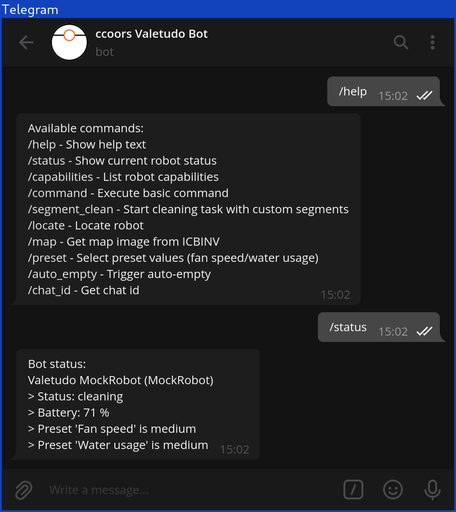
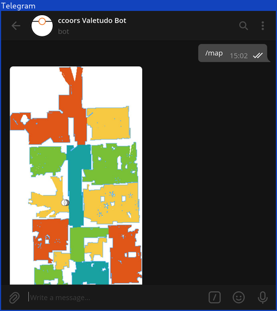
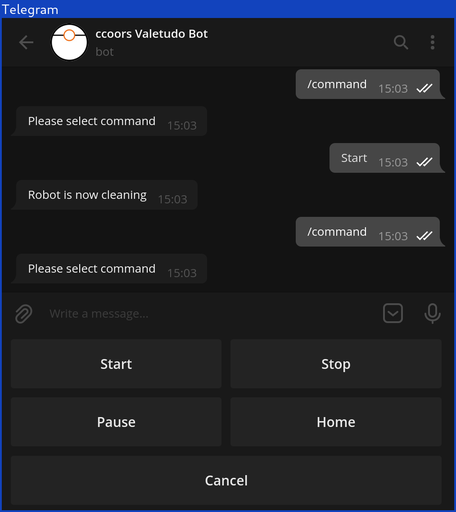
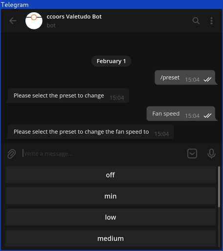
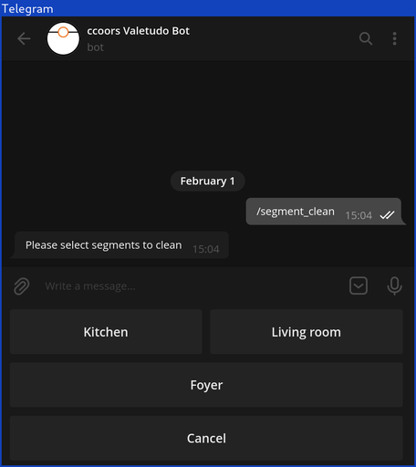

# valegram-bot


_A Telegram Bot for [Valetudo](https://valetudo.cloud)_

This bot allows controlling a Valetudo instance via Telegram. It runs directly on the vacuum robot, using the runtime
provided by Valetudo.

Please note that this bot is in its very early stages of development and is targeted at more technically inclined users.

This bot uses the Valetudo HTTP-API v2. Support for MQTT is not (yet?) implemented.

|  |  |
| -------------------------------------- | -------------------------------------- |
|  |  |
|  |

## Installation

Installation is a bit complicated, due to how Telegram Bots work.

### Create Telegram Bot

Create a Telegram Bot using [Botfather](https://core.telegram.org/bots#6-botfather). Remember the `token`. Start the bot
by adding it to your contacts and clicking the "Start" button.

### Download valegram-bot

Download the latest valegram-bot release to your robot. On Dreame, run this command, adjusting `v0.1.0` to the latest
release.

```shell
cd /data
wget -O valegram-bot.js https://github.com/ccoors/valegram-bot/releases/download/v0.1.0/valegram-bot.js
```

### Setup valegram-bot

Start the bot directly from the shell. Replace `$$$BOT_TOKEN$$$` with the token obtained from BotFather earlier.

```shell
PKG_EXECPATH=PKG_INVOKE_NODEJS VALEGRAM_BOT_TOKEN="$$$BOT_TOKEN$$$" ./valetudo valegram-bot.js
```

The bot needs to know which chats to respond to - otherwise everybody could control your robot. You can use
the `/chat_id` command in Telegram to get your chat id (eg. `104325692`).

Stop the bot (CTRL+C) and add it to your autostart script (`/data/_root_postboot.sh` on Dreame). I suggest extending the
final if-block like this (replace `104325692` with your chat id):

```
if [[ -f /data/valetudo ]]; then
        VALETUDO_CONFIG_PATH=/data/valetudo_config.json /data/valetudo > /dev/null 2>&1 &
        sleep 30
        PKG_EXECPATH=PKG_INVOKE_NODEJS VALEGRAM_BOT_TOKEN="$$$BOT_TOKEN$$$" CHAT_IDS='[104325692]' /data/valetudo /data/valegram-bot.js > /tmp/valegram-log.log 2>&1 &
fi
```

Alternatively, create a wrapper shell-script, which may prove more to be maintainable in the future.

### Add commands to BotFather (optional)

Run the `/help` command in Telegram. Remove the `/` from each line, use `/setcommands` in BotFather and set the command block.

## Configuration

valegram-bot is configured through environment variables.

| Variable                 | Description                                                                                                                                                                                         | Default             |
| ------------------------ | --------------------------------------------------------------------------------------------------------------------------------------------------------------------------------------------------- | ------------------- |
| `VALEGRAM_BOT_TOKEN`     | The bot token                                                                                                                                                                                       | `""`                |
| `VALETUDO_URL`           | The URL Valetudo can be reached under                                                                                                                                                               | `http://localhost/` |
| `VALETUDO_HTTP_TIMEOUT`  | The timeout for HTTP requests to Valetudo                                                                                                                                                           | `10_000`            |
| `VALETUDO_AUTH_USERNAME` | The username for HTTP-Basic-Auth                                                                                                                                                                    | `""`                |
| `VALETUDO_AUTH_PASSWORD` | The password for HTTP-Basic-Auth                                                                                                                                                                    | `""`                |
| `CHAT_IDS`               | The chat ids valegram-bot should respond to. JSON array of numbers.                                                                                                                                 | `[]`                |
| `ICBINV_URL`             | If you run [ICBINV](https://github.com/Hypfer/ICantBelieveItsNotValetudo) with an enabled webserver, set the URL to `ICBINV_URL=http://ICBINV_HOST:3000/api/map/image` to enable the `/map` command | `""`                |
